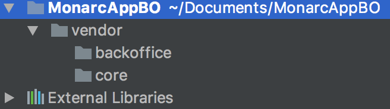
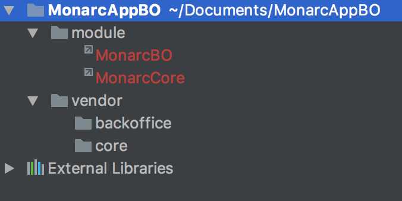
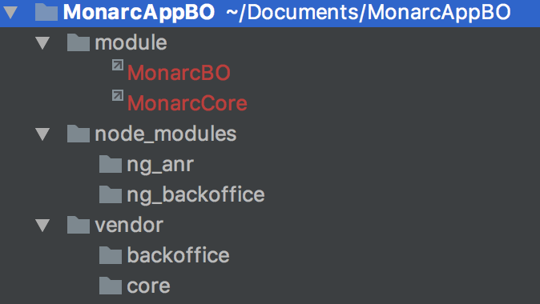

Skeleton Monarc Project
=======================

*Disclaimer: This is a work in progress and software is still in alpha stage.*

Introduction
------------
Skeleton Monarc Project.

Installation
------------

PHP & MySQL
-----------
Install PHP (version 7.0 recommended) with Apache (or Nginx) with extensions : xml, mbstring, mysql, zip, unzip, mcrypt, intl, imagick (extension php)
For Apache add mods : rewrite, ssl (a2enmod)

Install MySQL (version 5.7 recommended) or MariaDb equivalent

Using Composer (recommended)
----------------------------
If not already done, install composer relevant to your distribution. Then, clone the repository and manually invoke `composer`:

    cd my/project/dir
    git clone ssh://github.com/monarc-project/MonarcAppBO.git ./monarc
    cd monarc
    composer install -o (modifier le package.json deux errreurs passer en dev-beta le core et il y a un / en trop pour zm-core)

(The `self-update` directive is to ensure you have an up-to-date `composer.phar`
available.)

Databases
---------
Create 2 databases:

    CREATE DATABASE monarc_master DEFAULT CHARACTER SET utf8 DEFAULT COLLATE utf8_general_ci;
    CREATE DATABASE monarc_common DEFAULT CHARACTER SET utf8 DEFAULT COLLATE utf8_general_ci;

Change Sql Mode in my.cnf:

    sql-mode = MYSQL40

There are 2 databases:
* monarc_common contain models and data create by smile.
* monarc_master contain all user and authentication information

Once the databases are created, extract and import the extracted file to the ***monarc_common*** database:

    tar -xzvf db-bootstrap/monarc-common.tar.gz -C db-bootstrap/
    mysql -u sqlmonarcuser -p monarc_common < db-bootstrap/monarc-common.sql

Symbolics links
---------------

The project is splited on 2 parts :
* an Api in charge of retrieve data
* an interface to display data

The Api is not direct modules of the project but libraries.
You must create modules with symbolics link to libraries

Create 2 symbolics links at project root:

    mkdir module
    cd module
    ln -s ./../vendor/monarc/core MonarcCore;
    ln -s ./../vendor/monarc/backoffice MonarcBO;

There is 2 parts:
* one only for front office
* one common for front office and back office (private project)

It is develop with zend framework 2

Interfaces
----------
Repository for angular at project root:

    mkdir node_modules
    cd node_modules
    git clone https://github.com/monarc-project/ng-backoffice.git ng_backoffice
    git clone https://github.com/monarc-project/ng-anr.git ng_anr

 There is 2 parts:
 * one only for front office (ng_client)
 * one common for front office and back office (private project) (ng_anr)

 It is develop with angular framework version 1

Web Server Setup
----------------

### PHP CLI Server

The simplest way to get started if you are using PHP 5.4 or above is to start the internal PHP cli-server in the root directory:

    php -S 0.0.0.0:8080 -t public/ public/index.php

This will start the cli-server on port 8080, and bind it to all network
interfaces.

Note: The built-in CLI server is *for development only*.

### Apache Setup

To setup apache, setup a virtual host to point to the public/ directory of the
project and you should be ready to go! It should look something like below:

    <VirtualHost 0.0.0.0:80>
        ServerName monarc.localhost
        DocumentRoot /path/to/monarc/public
        SetEnv APPLICATION_ENV "development"
        <Directory /path/to/monarc/public>
            DirectoryIndex index.php
            AllowOverride All
            Require All Granted
        </Directory>
    </VirtualHost>

Database connection
-------------------

Create file `config/autoload/local.php`:

    return array(
        'doctrine' => array(
            'connection' => array(
                'orm_default' => array(
                    'params' => array(
                        'host' => 'host',
                        'user' => 'user',
                        'password' => 'password',
                        'dbname' => 'monarc_common',
                    ),
                ),
                'orm_cli' => array(
                    'params' => array(
                        'host' => 'host',
                        'user' => 'user',
                        'password' => 'password',
                        'dbname' => 'monarc_master',
                    ),
                ),
            ),
        ),
    );

Configuration
-------------

Create file configuration

    sudo cp /config/autoload/local.php.dist /config/autoload/local.php

Update connexion information to local.php and global.php

Configuration files are stored in cache.
If yours changes have not been considered, empty cache by deleting file in /data/cache
You might need to create the folders if non-existant. Also, the /data/cache folder needs to be owned by the internet user (www-data in ubuntu).

Install Grunt
-------------

    sudo apt-get install nodejs
    sudo apt-get install npm
    sudo npm install -g grunt-cli

Only for linux system:

    sudo ln -s /usr/bin/nodejs /usr/bin/node (seulement linux)

Update project
--------------
Play script (mandatory from the root of the project)(pull and migrations):

    sudo /bin/bash ./scripts/update-all.sh

This shell script use others shell script. May be you node to change rights of these others files. If you receive an error like "msgfmt command not found", install the necessary package. (gettext in ubuntu)

Create Initial User and Client
------------------------------

Create first user:

    php ./vendor/robmorgan/phinx/bin/phinx seed:run -c ./module/MonarcBO/migrations/phinx.php

The username is *admin@admin.test* and the password is *admin*.

Data Model
----------

monarc_common

License
-------

This software is licensed under [GNU Affero General Public License version 3](http://www.gnu.org/licenses/agpl-3.0.html)

Copyright (C) 2016-2017 SMILE gie securitymadein.lu
